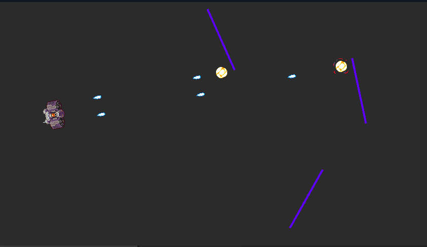

<br>

# Basic bullet

SDK sample behavior for a basic bullet movement.

Author: Master Pose <br>
Website: [https://github.com/C3Framework/examples](https://github.com/C3Framework/examples) <br>
Addon Url: [https://github.com/C3Framework/examples](https://github.com/C3Framework/examples) <br>
Download Latest Version : [Version: 1.0.0.0](https://github.com/C3Framework/examples/releases/latest) <br>

<br>

<sub>

Made using [c3-framework](https://github.com/C3Framework/framework)

</sub>

## Table of Contents

- [Usage](#usage)
- [Examples Files](#examples-files)
- [Properties](#properties)
- [Actions](#actions)
- [Conditions](#conditions)
- [Expressions](#expressions)

---

## Usage

First you must install the dependencies via NPM using:

```
npm install
```

To build the addon, run the following command:

```
npx c3fo build
```

To start the dev server, run:

```
npx c3fo build -D
```

The build uses the `addon.ts` file for the configurations and the `runtime.ts` file as the entry point to generate everything else.
The files defined with `@AceClass` contain all the Actions, Conditions and Expressions logic and configuration, you may want to check them.

## Examples Files

- [basic-bullet](./examples/basic-bullet.c3p)
<br>

<br>

---

## Properties

| Property Name | Description | Type |
| --- | --- | --- |
| Speed | Speed of movement in pixels per second. | float |
| Stop on solid | Whether to automatically stop moving when colliding with a solid. | check |
| Enabled | Whether the behavior is initially enabled or disabled. | check |

---

## Actions

| Action | Description | Params
| --- | --- | --- |
| Set Speed | Set the current movement speed. | Speed *(number)* <br> |
| Set Enabled | Set whether the behavior is enabled. | Enabled *(any)* <br> |

---
## Conditions

| Condition | Description | Params
| --- | --- | --- |
| Compare Speed | Compare the current speed of the behavior. | Comparison *(cmp)* <br>Speed *(number)* <br> |
| On Hit Solid | Triggered when hitting a solid when 'Stop on solid' is enabled. |  |

---
## Expressions

| Expression | Description | Return Type | Params
| --- | --- | --- | --- |
| Speed | The current speed in pixels per second | number |  |
