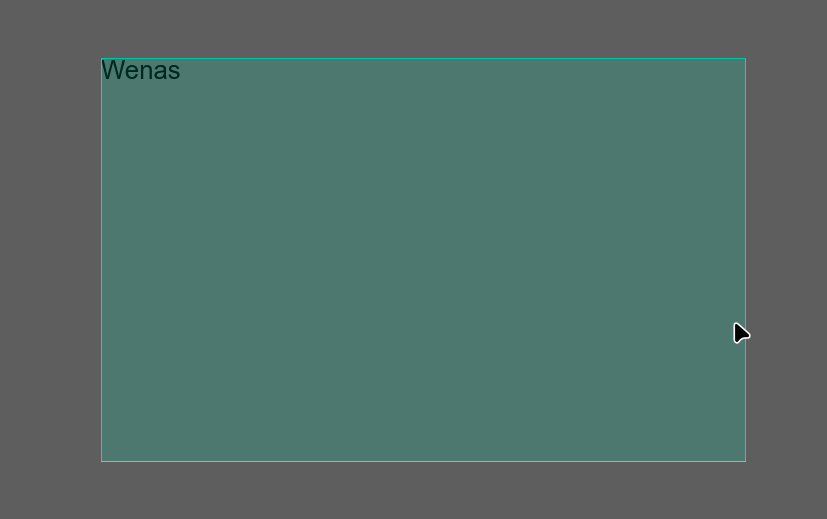

<br>

# My text plugin

Example custom text drawing Construct 3 plugin.

Author: Master Pose <br>
Website: [https://github.com/C3Framework/examples](https://github.com/C3Framework/examples) <br>
Addon Url: [https://github.com/C3Framework/examples](https://github.com/C3Framework/examples) <br>
Download Latest Version : [Version: 1.0.0.0](https://github.com/C3Framework/examples/releases/latest) <br>

<br>

<sub>

Made using [c3-framework](https://github.com/C3Framework/framework)

</sub>

## Table of Contents

- [Usage](#usage)
- [Examples Files](#examples-files)
- [Properties](#properties)
- [Actions](#actions)
- [Conditions](#conditions)
- [Expressions](#expressions)

---

## Usage

First you must install the dependencies via NPM using:

```
npm install
```

To build the addon, run the following command:

```
npx c3fo build
```

To start the dev server, run:

```
npx c3fo build -D
```

The build uses the `addon.ts` file for the configurations and the `runtime.ts` file as the entry point to generate everything else.
The files defined with `@AceClass` contain all the Actions, Conditions and Expressions logic and configuration, you may want to check them.

## Examples Files

- [editor-text](./examples/editor-text.c3p)
<br>

<br>

---

## Properties

| Property Name | Description | Type |
| --- | --- | --- |
| Font | The font to use. | font |
| Text | The text to display. | longtext |

---

## Actions

| Action | Description | Params
| --- | --- | --- |
| Alert | Do a dummy alert. |  |

---
## Conditions

| Condition | Description | Params
| --- | --- | --- |
| Is Large Number | Test if a number is greater than 100. | Number *(number)* <br> |

---
## Expressions

| Expression | Description | Return Type | Params
| --- | --- | --- | --- |
| Double | Double a number. | any | Number *(number)* <br> |
